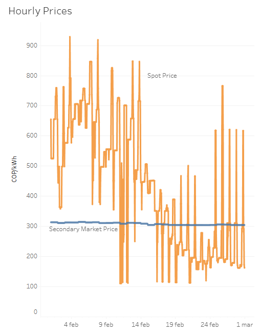
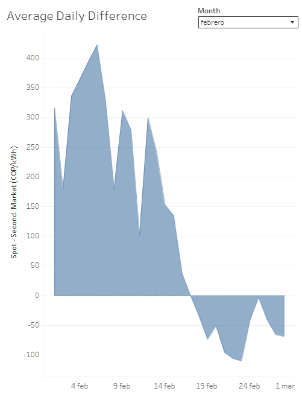
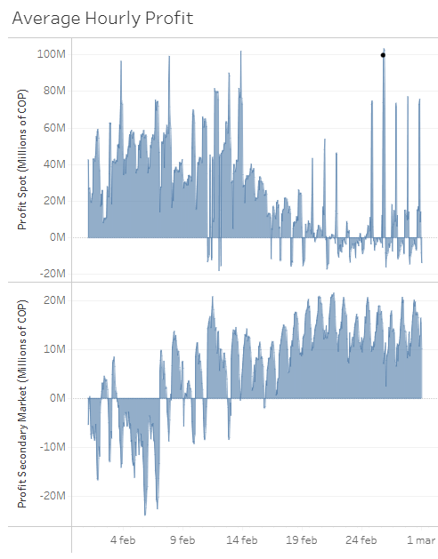
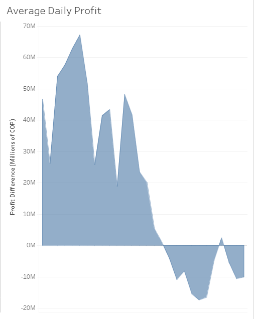
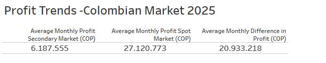
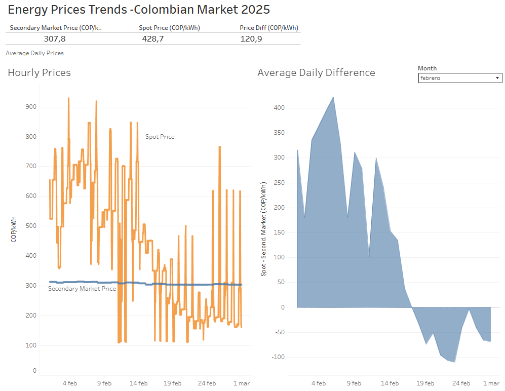

# Colombian Energy Market - Stock vs Secondary Market Dashboards

## Introduction
This Energy Market Price Analysis Tableau dashboard was developed to understand how the spot market prices and secondary market prices in Colombia have evolved, and to evaluate whether there are potential gains from participating in either of the two markets.

This dataset, available from the Sinergox platform of XM (https://sinergox.xm.com.co/Paginas/Home.aspx), contains all market transactions for the year 2025. It features a wide range of variables, such as market prices, plant capacity, plant generation, and demand forecasts, among others.

## Key questions
This dashboard seeks to answer the following questions surrounding the dynamics of Colombia’s energy markets:

- ¿What's the evolution of prices between the spot market and the secondary market?

- ¿Do companies have incentives to participate in the secondary market compared to the spot market?

- ¿Which types of plants (by energy source) benefit the most from participating in the secondary market?

## Methodology

This dashboard was built in two steps.

**Step 1: Database Exploration in Python**  
The first step involved exploring the database using Python, as documented in the Jupyter Notebook. The goal was to reshape, organize and merge the data through operations such as **melts**, **pivots**, and **filters** across different tables. Libraries such as **pandas** and **numpy** were employed to handle data transformations, ensure consistency, and prepare the dataset for further analysis. This stage focused on structuring the information to highlight key variables such as **market prices, secondary market prices, generation, and plant characteristics**.

**Two notes:**
- This initial analysis can be found in the Jupyter Notebook within the *Data_Exploration* folder.  
- It is important to note that this exercise does not use or demonstrate **causal** or **predictive interpretation methodologies**. Therefore, the insights derived are purely **descriptive** of the analyzed sample.  

**Step 2: Trend Analysis and Visualization in Tableau**  
The second step was to conduct trend analysis and present the results through **Tableau dashboards**. Tableau was used to generate interactive visualizations that allowed for a clearer understanding of how **spot market prices** and **secondary market prices** evolved over time, as well as how **profitability indicators** behaved across different plant types.  

Since this exercise was not focused on modifying the original dataset, no **missing values** or **complex data typologies** were introduced.

## Graphs

### Hourly Prices - Line Chart  
This line chart shows hourly prices by market type and month.

### Daily Difference in Prices - Line Chart  
This line chart shows average daily difference in price by month.

### Hourly Profit - Line Chart  
This line chart shows hourly profits by plant type and month.

### Daily Difference in Profit - Line Chart  
This line chart shows average daily difference in profit by month.

## KPI Cards

### Profitability Indicator by Market 
This card presents the profitability indicator comparing the **spot market** and the **secondary market**. The indicator is defined as:

$$ 
\pi = \big( P_{\text{sale}} - P_{\text{bid}}^{MC} \big) \cdot \text{Generation} 
$$ 

**Assumptions:** 
- The **offer price** ($P_{\text{bid}}^{MC}$) is assumed to be equal to the **marginal cost**, given the competitive nature of the market.
- $P_{\text{sale}}$ represents the spot market price or secondary market price (COP/kWh).
- **Generation** is measured in kWh. - The result $\pi$ is expressed in COP, representing the potential gain from participating in the spot market relative to the secondary market.

### Profitability by Plant Type (Energy Source)
This card shows which types of plants (e.g., hydro, thermal) benefit the most from participating in the secondary market. By applying the profitability indicator across different plant sources, we can identify which technologies capture higher margins and whether incentives exist to favor the secondary market over the spot market.

## Widgets and Others

### Data Validation, Filtered List and Sheet Protections  
To ensure the tool is easy to use and free from erroneous user manipulations, slicers with validators and filtered lists were created and organized. 

## Formulas and Functions
## Data Processing Methods (Python) 

1. **Iterative Reshaping (Melt – Pandas)**  
   Formula:  
   `for df, name in zip(dfs, names): df_long = df.melt(id_vars=id_vars, value_vars=hour_cols, var_name="Hour", value_name="Value")`  
   Description:  
   Iterative transformation of multiple DataFrames from wide to long format, standardizing hourly columns into a normalized structure for time-based analysis.

2. **Merge – Pandas**  
   Formula:  
   `plant_info = bid_price_reshape.merge(source_descrip_clean, on=["Plant"], how="inner").merge(generation_reshape, on=["Date","Hour","Plant"], how="inner")`  
   Description:  
   Integration of bid prices, plant characteristics, and generation data using common keys to build a consolidated operational dataset.

3. **Sort and Filter**  
   Formula:  
   `plantmarket_info_filtered = plantmarket_info[plantmarket_info["PlantDispType"]=="DESPACHADO CENTRALMENTE"].sort_values(by=["Plant","Date","Hour"])`  
   Description:  
   Filtering of centrally dispatched plants and chronological ordering by plant and hour for structured analysis.

4. **Variable Creation**  
   Formula:  
   `profit = (market_price - bid_price) * generation`  
   Description:  
   Creation of derived profitability variables for spot and secondary markets based on price differentials and actual generation.

5. **Exportation**  
   Formula:  
   `plantmarket_info_filtered.to_excel("plantprofit_info.xlsx", index=False)`  
   Description:  
   Export of processed datasets to Excel files for reporting, visualization, and external analysis.

## Key Insights

- During the first months of the year, **spot market prices were consistently higher than secondary market prices**. However, as prices declined over time, both markets began to **converge**, showing much smaller differences toward the later months.

- From an **hourly analysis**, plants that operate mainly during **off-peak hours** (valley/off-peak hours: periods of low system demand, typically late night and early morning) are the ones that **benefit the most from relatively higher secondary market prices**, compared to the spot market.

- Although the differences are not large, **solar and hydro plants are the most favored by participation in the secondary market**, since their generation profiles align better with off-peak and mid-load hours. In contrast, **thermal plants**, which usually operate during **peak hours** (peak hours: periods of highest system demand, commonly in the late afternoon and evening), tend to benefit more from the **higher prices of the spot market**.

- Since the **secondary market price is defined on a daily basis rather than hourly**, different plant technologies are **not able to fully exploit the positive price differential during off-peak hours**, because the **high revenues earned in peak hours in the spot market compensate and dominate overall profitability**.

- For this reason, **thermal plants that do not typically operate during the afternoon peak** are among the few technologies for which **selling energy in the secondary market could represent a viable strategic alternative**, as they are less exposed to the high spot-price advantage observed in peak hours.

## Additional Dashboard

